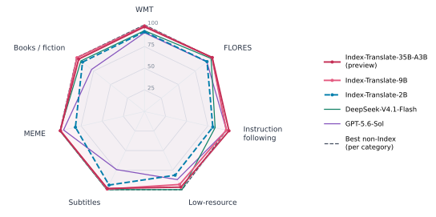
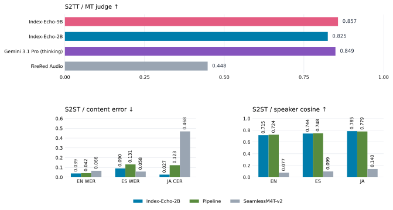
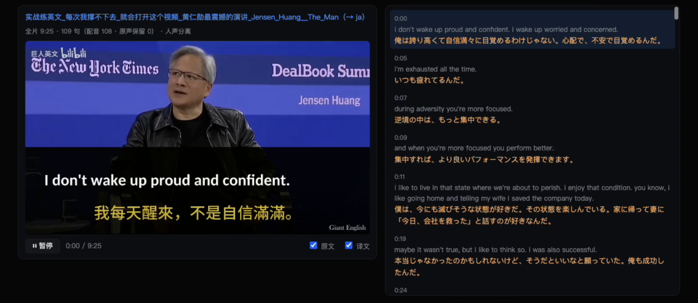
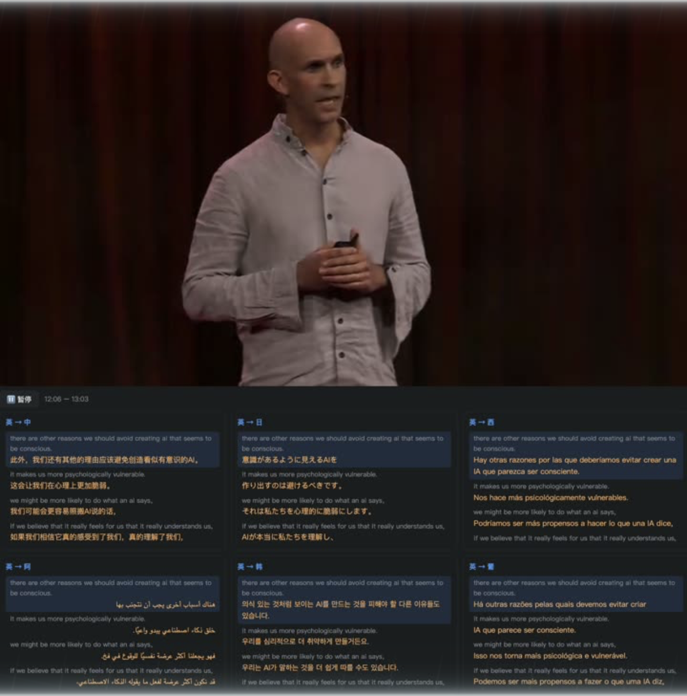
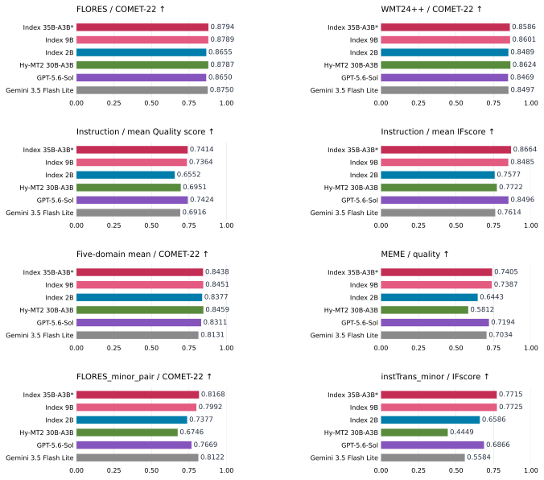
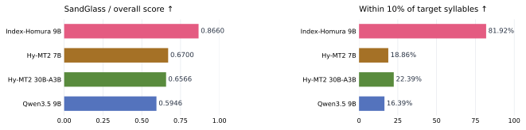
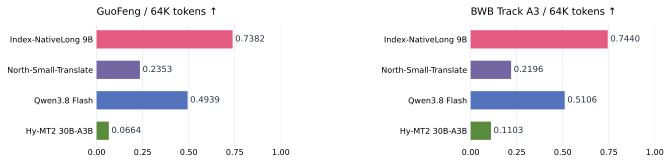

<p align="center">English · <a href="README_zh.md">中文</a></p>

<h1 align="center">Index-Translate</h1>
<p align="center"><strong>A Multilingual Translation Model Family</strong><br>Text, Speech, Controlled Dubbing, and Long-Document Translation</p>

<p align="center">
  <a href="https://index-translate.bilibili.com/">Online Demo</a> ·
  <a href="https://huggingface.co/collections/IndexTeam/index-translate">Hugging Face</a> ·
  <a href="https://modelscope.cn/collections/IndexTeam/Index-Translate">ModelScope</a> ·
  <a href="docs/Index_Translate_Series_Technical_Report.pdf">Technical Report</a>
</p>

Index-Translate is a family of multilingual translation models built on Qwen3.5. The text models cover **150 languages** and follow translation instructions such as terminology, formatting, and content-preservation requirements. The family extends this foundation to speech, syllable-controlled translation, and full-document translation.

- **Index-Translate** translates text, structured content, and community expressions.
- **Index-Echo** produces translated subtitles or speech conditioned on the source speaker's voice.
- **Index-Homura** adjusts translations toward a specified target syllable count.
- **Index-NativeLong** translates complete documents with context across passages.

<p align="center"></p>

The radar includes **35B-A3B (preview), 9B, and 2B**, with fixed per-axis min–max ranges across all 14 models. Its seven axes are WMT, FLORES, instruction following, low-resource translation, subtitles, MEME, and books/fiction. Instruction following averages instTrans and IFMTBench IFscore. The normalized scale is not an accuracy percentage. The gray dashed line combines the best non-Index score on each axis and does not represent one model. [Raw category scores](docs/assets/seven_category_scores_raw.csv) · [Figure notes](docs/assets/README.md) · [Individual benchmark results](docs/evaluation.md).

[Models](#models) · [Quick start](#quick-start) · [Examples](#examples) · [Evaluation](#evaluation) · [Benchmarks](#benchmarks) · [Applications](#applications) · [TODO](#todo)

## Models

The links below provide **2B, 9B, and 35B-A3B (preview)** text-model checkpoints. Evaluation results are included in the [comparison tables](docs/evaluation.md).

| Model | Task and released package coverage | Hugging Face | ModelScope | Inference |
|---|---|---|---|---|
| **Index-Translate** | Text translation and instructions across 150 languages | [2B](https://huggingface.co/IndexTeam/Index-Translate-2B) · [9B](https://huggingface.co/IndexTeam/Index-Translate-9B) · [35B-A3B (preview)](https://huggingface.co/IndexTeam/Index-Translate-35B-A3B) | [2B](https://modelscope.cn/models/IndexTeam/Index-Translate-2B) · [9B](https://modelscope.cn/models/IndexTeam/Index-Translate-9B) · [35B-A3B (preview)](https://modelscope.cn/models/IndexTeam/Index-Translate-35B-A3B) | [Guide](inference/llm/README.md) |
| **Index-Echo S2TT** | Speech → subtitles; packaged script: zh→en/ja/es | [2B](https://huggingface.co/IndexTeam/Index-Echo-S2TT-2B) · [9B](https://huggingface.co/IndexTeam/Index-Echo-S2TT-9B) | [2B](https://modelscope.cn/models/IndexTeam/Index-Echo-S2TT-2B) · [9B](https://modelscope.cn/models/IndexTeam/Index-Echo-S2TT-9B) | [Guide](inference/echo-s2tt/README.md) |
| **Index-Echo S2ST** | Speech → speech; zh→en/es/ja, en→zh/es/ja | [2B](https://huggingface.co/IndexTeam/Index-Echo-S2ST-2B) · [9B](https://huggingface.co/IndexTeam/Index-Echo-S2ST-9B) | [2B](https://modelscope.cn/models/IndexTeam/Index-Echo-S2ST-2B) · [9B](https://modelscope.cn/models/IndexTeam/Index-Echo-S2ST-9B) | [Guide](inference/echo-s2st/README.md) |
| **Index-Homura** | Translation with a target syllable count | [2B](https://huggingface.co/IndexTeam/Index-Homura-2B) · [9B](https://huggingface.co/IndexTeam/Index-Homura-9B) | [2B](https://modelscope.cn/models/IndexTeam/Index-Homura-2B) · [9B](https://modelscope.cn/models/IndexTeam/Index-Homura-9B) | [Guide](inference/llm/README.md) |
| **Index-NativeLong** | Long documents; fixed templates: zh↔en, zh↔ja | [2B](https://huggingface.co/IndexTeam/Index-Nailong-2B) · [9B](https://huggingface.co/IndexTeam/Index-Nailong-9B) | [2B](https://modelscope.cn/models/IndexTeam/Index-Nailong-2B) · [9B](https://modelscope.cn/models/IndexTeam/Index-Nailong-9B) | [Guide](inference/llm/README.md) |

**Naming:** Index-NativeLong is published under the model IDs `IndexTeam/Index-Nailong-2B` and `IndexTeam/Index-Nailong-9B`. Use those IDs in commands. Language support for the speech and long-document packages is listed separately from the text models' 150-language coverage.

## Quick start

Start with the 2B text model on a CUDA GPU using a vLLM build with Qwen3.5 support. From a terminal:

```bash
git clone https://github.com/bilibili/Index-Translate.git
cd Index-Translate
pip install -U vllm
pip install -r inference/llm/requirements.txt
vllm serve IndexTeam/Index-Translate-2B --host 127.0.0.1 --port 8000 --max-model-len 4096
```

From the same repository directory in **another terminal**:

```bash
python inference/llm/translate.py \
  "你好，世界。今天天气不错，我们去公园散步吧。" \
  --target en --model IndexTeam/Index-Translate-2B
```

An output recorded with the released 2B model is:

> Hello, world. The weather is nice today. Let's go for a walk in the park.

The client defaults to greedy decoding (temperature 0) with thinking disabled. See [captured cases](inference/llm/cases/translate_cases.jsonl), [text inference and decoding](inference/llm/README.md), and [prompt examples](docs/prompts.md). The 4,096-token setting above is for this short-text example. NativeLong's shipped limits are **262,144 tokens for 2B** and **229,376 for 9B**, with training sequences up to 128K; the context window must hold both input and generated translation.

For audio, use the dedicated [S2TT subtitle guide](inference/echo-s2tt/README.md) or [S2ST dubbing guide](inference/echo-s2st/README.md).

## Examples

These examples are drawn from the [official demo](https://index-translate.bilibili.com/?p=/site/home.html#benchmark-cases). Outputs below illustrate individual cases; full comparisons and task settings are available on the demo and in the report.

### Translate text while preserving a hashtag

**Task:** translate this JSON into Korean, preserving its structure, stars, and the Chinese hashtag.

```json
{"title": "⭐2月13日例行维护公告⭐", "content": "#热血航线大和登场#"}
```

**Index-Translate-9B:**

```json
{"title": "⭐2월 13일 정기 점검 공지⭐", "content": "#热血航线大和登场#"}
```

The title is translated while the requested hashtag remains unchanged. [Try text translation](https://index-translate.bilibili.com/?p=/site/translate.html&lang=en).

### Keep the meaning of a community expression

**Source:** 狒瘾犯了就去打 — in this gaming context, “狒瘾” refers to the urge to play Final Fantasy XIV.

| Model | English output |
|---|---|
| Index-Translate-9B | When the FFXIV itch hits, just go play. |
| Index-Translate-2B | Go play when my FFXIV addiction kicks in. |
| Hy-MT2-7B | If you get monkey addiction, go fight. |

### Set the translation's syllable budget

**Source:** 生活两天，是一种什么体验. Index-Homura-9B produces different wording for three requested lengths:

| Target / observed syllables | English output |
|---|---|
| 10 / 10 | to live for two days. What would that be like? |
| 14 / 14 | What would it be like to live there for two days, I wonder? |
| 18 / 18 | What would it be like to live there for two days, trying to get by somehow? |

These three examples meet their targets; syllable control is approximate in general, and spoken duration also depends on delivery. [Try Index-Homura](https://index-translate.bilibili.com/?p=/site/syllable.html&lang=en).

### Keep a character's name consistent across a document

In a roughly 32K-token fantasy document, “王妃” is a character's name. The following extracts compare native full-document translation with the same 9B model in a chunked workflow using neighboring context and an automatic glossary.

| Source position | Index-NativeLong-9B full document | Same 9B with chunking |
|---|---|---|
| 31.3% | Mentor Wang Fei | Instructor Wangfei |
| 56.6% | Wang Fei | the Dean |
| 84.8% | Wang Fei | The Queen Consort |

Positions are measured by source characters. The full-document output keeps the name at these locations; the demo also shows how an externally supplied glossary can repair the chunked result. [Try Index-NativeLong](https://index-translate.bilibili.com/?p=/site/doc.html&lang=en).

### Watch speech translation



The S2ST panels compare the deployed 2B system, a pipeline, and SeamlessM4T-v2. This demo comparison is separate from the six-direction matched study in the report; SeamlessM4T-v2 does not clone the source voice.

<table>
<tr><th>Speech-to-speech dubbing</th><th>Multilingual subtitles</th></tr>
<tr>
<td align="center"><a href="https://index-translate.bilibili.com/?p=/site/assets/blog/echo-demo.mp4"></a></td>
<td align="center"><a href="https://index-translate.bilibili.com/?p=/site/assets/blog/echo-demo-s2tt.mp4"></a></td>
</tr>
<tr><td>English video with Japanese dubbing</td><td>Video with translations in multiple languages</td></tr>
</table>

Click either preview to watch the video, or [open Index-Echo](https://index-translate.bilibili.com/?p=/site/index.html&lang=en). The website demonstration and the packaged inference interfaces have different language coverage; the [model table](#models) lists the released interfaces.

## Evaluation



The charts reproduce the updated demo comparison. *35B-A3B is the preview model. The instruction panels average instTrans and IFMTBench: Quality combines instTrans quality and IFMTBench XCOMET-XXL, while IFscore averages their instruction scores. Individual benchmark metrics remain separate in the tables below.

The following tables cover general text translation, low-resource translation, and low-resource instruction following. FLORES uses COMET-22; WMT26 uses a judge score. instTrans reports translation quality and instruction following separately. MEME measures translation quality for community and cultural expressions. Higher is better for every metric in the first table below; scales differ across columns.

| Model | FLORES ↑ | WMT26 ↑ | instTrans quality ↑ | instTrans IFscore ↑ | MEME ↑ |
|---|---:|---:|---:|---:|---:|
| **Index-Translate-35B-A3B (preview)** | 0.8794 | 76.76 | 0.6901 | 0.8336 | 0.7405 |
| **Index-Translate-9B** | 0.8789 | 75.35 | 0.6771 | 0.8209 | 0.7387 |
| **Index-Translate-2B** | 0.8655 | 60.26 | 0.5391 | 0.7569 | 0.6443 |
| Hy-MT2-7B | 0.8747 | 60.51 | 0.5143 | 0.6079 | 0.5139 |
| Hy-MT2-30B-A3B | 0.8787 | 66.81 | 0.5725 | 0.6415 | 0.5812 |
| DeepSeek-V4.1-Flash | 0.8762 | 83.55 | 0.6068 | 0.6374 | 0.7424 |
| GPT-5.6-Sol | 0.8650 | 89.10 | 0.6902 | 0.7624 | 0.7194 |
| Gemini 3.5 Flash Lite | 0.8750 | 79.52 | 0.6068 | 0.6374 | 0.7034 |

### Low-resource translation and instruction following

FLORES_minor_pair evaluates general translation in low-resource languages; instTrans_minor reports translation quality and instruction following separately. Off-target is the percentage of outputs in a language other than the target language; lower is better. Higher is better for the other metrics. Bold marks the best value in each column of this table.

| Model | FLORES_minor_pair<br>COMET-22 ↑ | FLORES_minor_pair<br>XCOMET-XXL ↑ | FLORES_minor_pair<br>off-target ↓ | instTrans_minor<br>Quality ↑ | instTrans_minor<br>IFscore ↑ | instTrans_minor<br>off-target ↓ |
|---|---:|---:|---:|---:|---:|---:|
| **Index-Translate-35B-A3B (preview)** | 0.8168 | 0.7164 | 2.4% | 0.5151 | 0.7715 | 4.05% |
| **Index-Translate-9B** | 0.7992 | 0.6805 | 4.0% | 0.5222 | **0.7725** | **3.47%** |
| **Index-Translate-2B** | 0.7377 | 0.4817 | 4.2% | 0.3050 | 0.6586 | 3.97% |
| Hy-MT2-7B | 0.4626 | 0.3334 | 35.7% | 0.1121 | 0.2405 | 45.40% |
| Hy-MT2-30B-A3B | 0.6746 | 0.5359 | 14.5% | 0.2246 | 0.4449 | 15.47% |
| DeepSeek-V4.1-Flash | **0.8333** | **0.7297** | **1.3%** | 0.4793 | 0.5854 | 5.73% |
| GPT-5.6-Sol | 0.7669 | 0.6918 | 10.4% | **0.5757** | 0.6866 | 7.73% |
| Gemini 3.5 Flash Lite | 0.8122 | 0.6995 | 3.3% | 0.3927 | 0.5584 | 12.18% |

Among the three Index-Translate models, 35B-A3B (preview) has the highest FLORES_minor_pair COMET-22 and XCOMET-XXL scores (**0.8168 / 0.7164**), with a **2.4%** off-target rate. On instTrans_minor, Index-Translate-9B achieves the highest IFscore (**0.7725**) and lowest off-target rate (**3.47%**) among all compared models; its quality score is **0.5222**.

[Full tables](docs/evaluation.md) retain all comparison models, low-resource metrics, WMT24++, IFMTBench, domain averages, general capabilities, speech, SandGlass, and long-document results. Detailed settings and analysis are in the [technical report](docs/Index_Translate_Series_Technical_Report.pdf).

### Index-Homura and Index-NativeLong



SandGlass overall score and length adherence from the demo; the overall score differs from the separate translation-quality metric in the detailed tables.



GuoFeng and BWB Track A3 at 64K Chinese-side tokens.

For the specialized models, Index-Homura-9B reaches **81.92% within 10% of the target syllable count** on SandGlass. Index-NativeLong-9B scores **0.7891 / 0.7683 / 0.8848** on GuoFeng / BWB / Books. The full tables include translation-quality tradeoffs and evaluation notes.

## Benchmarks

| Benchmark | What it evaluates | Coverage |
|---|---|---|
| **instTrans** | Translation quality and compliance with user instructions, scored separately | 3,000 Chinese-to-20-language tasks, plus 2,793 low-resource tasks; 10 constraint types |
| **MEME** | Meaning, naturalness, and cultural context in community expressions | 3,638 Chinese-to-English examples; 703 terms and 857 distinct senses |
| **SandGlass** | Translation quality and control of target syllable counts | 3,600 cases: 300 subtitle sentences × 4 target languages × 3 length budgets |

**Release status:** planned benchmark releases are listed under [TODO](#todo). Download links will be added when available. The [technical report](docs/Index_Translate_Series_Technical_Report.pdf) describes the evaluation now; [IFMTBench preprocessing](docs/evaluation.md#ifmtbench-preprocessing) is documented separately.

## Applications

- **[Browser extension](extension/README.md):** translate web pages through a locally deployed model using Chrome, Edge, or Firefox.
- **[Video dubbing pipeline](video-dub/README.md):** extract audio, separate vocals, segment speech, translate and dub, then align the result to the original video.

## News

- **2026-09-30:** released Index-Translate, with 2B / 9B / 35B-A3B (preview) text-model weights on Hugging Face and ModelScope, the technical report, and the online demo.

## TODO

- [ ] Release the official version of Index-Translate-35B-A3B.
- [ ] Open-source instTrans, SandGlass-V2, nailong-bench, and meme-bench.
- [ ] Add support for more languages to Index-Echo.
- [ ] Release larger models.

## Citation

```bibtex
@techreport{indextranslate2026,
  author={Tianjiao Li and Mengran Yu and Chenyu Shi and Lusheng Zhang and
          Qisi Chen and Yanshan Zhou and Ji Qi and Jingying Liu and
          Yuang Feng and Ziang Cui and Tianxing Yan},
  title={Index-Translate: A Multilingual Translation Model Family --- Text, Speech, Controlled Dubbing, and Long-Document Translation},
  institution={Index LLM Team},
  year={2026},
  month={September}
}
```

## License and feedback

[Apache-2.0](LICENSE). Questions and feedback are welcome through [GitHub Issues](https://github.com/bilibili/Index-Translate/issues).
