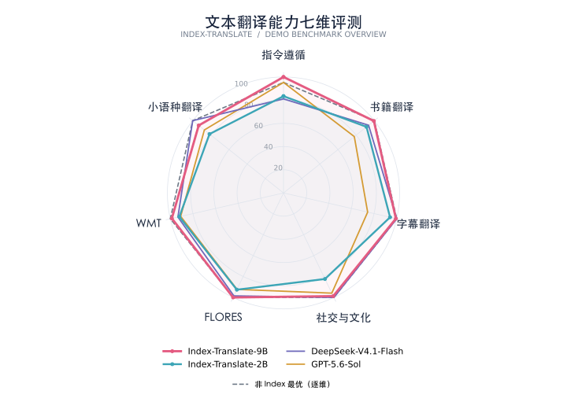
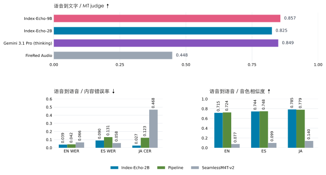
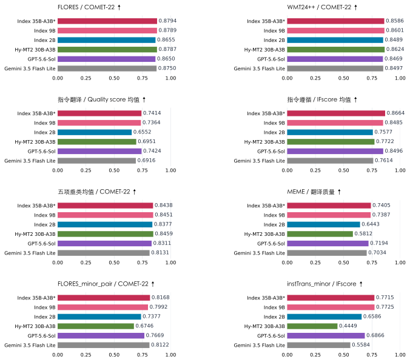
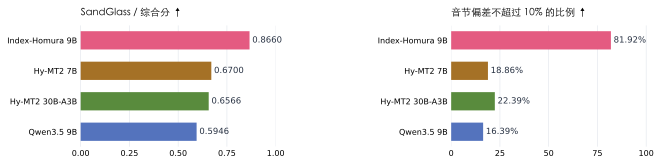
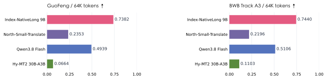

<p align="center"><a href="README.md">English</a> · 中文</p>

<h1 align="center">Index-Translate</h1>
<p align="center"><strong>多语言翻译模型家族</strong><br>文本、语音、可控配音与长文档翻译</p>

<p align="center">
  <a href="https://index-translate.bilibili.com/">在线 Demo</a> ·
  <a href="https://huggingface.co/collections/IndexTeam/index-translate">Hugging Face</a> ·
  <a href="https://modelscope.cn/collections/IndexTeam/Index-Translate">ModelScope</a> ·
  <a href="docs/Index_Translate_Series_Technical_Report.pdf">技术报告</a>
</p>

Index-Translate 是基于 Qwen3.5 构建的多语言翻译模型家族。文本模型覆盖**150 种语言**，支持术语、格式、保留内容等翻译指令，并将共同的多语基础扩展到语音、音节可控翻译和长文档翻译。

- **Index-Translate**：翻译文本、结构化内容与社区表达。
- **Index-Echo**：生成目标语言字幕或配音，配音时参考源语音的说话人声音特征。
- **Index-Homura**：根据指定的目标音节数调整译文。
- **Index-NativeLong**：输入完整文档，利用上下文维持前后联系。

<p align="center"></p>

新版雷达图包含 **35B-A3B（preview）、9B 和 2B**，归一化范围覆盖全部 14 款模型；七个维度依次为 WMT、FLORES、指令遵循、小语种、字幕翻译、MEME 和书籍网文。指令遵循取 instTrans 与 IFMTBench IFscore 的均值。

雷达图采用官网七类聚合分数，在完整对比模型集合上固定各维度的 min–max 范围进行归一化，并非准确率。灰色虚线是各维度非 Index 模型的最高值组合，不代表一个实际模型。[原始聚合分数](docs/assets/seven_category_scores_raw.csv) · [图表说明](docs/assets/README.md) · [单项评测结果](docs/evaluation_zh.md)。

[模型下载](#模型下载) · [快速上手](#快速上手) · [精选案例](#精选案例) · [评测结果](#评测结果) · [Benchmarks](#benchmarks) · [应用工具](#应用工具) · [TODO](#todo)

## 模型下载

下表提供 **2B、9B 与 35B-A3B（preview）** 文本模型权重，评测结果见[完整评测表](docs/evaluation_zh.md)。

| 模型 | 任务与发布包覆盖 | Hugging Face | ModelScope | 推理 |
|---|---|---|---|---|
| **Index-Translate** | 150 种语言的文本翻译与指令遵循 | [2B](https://huggingface.co/IndexTeam/Index-Translate-2B) · [9B](https://huggingface.co/IndexTeam/Index-Translate-9B) · [35B-A3B (preview)](https://huggingface.co/IndexTeam/Index-Translate-35B-A3B) | [2B](https://modelscope.cn/models/IndexTeam/Index-Translate-2B) · [9B](https://modelscope.cn/models/IndexTeam/Index-Translate-9B) · [35B-A3B (preview)](https://modelscope.cn/models/IndexTeam/Index-Translate-35B-A3B) | [使用说明](inference/llm/README_zh.md) |
| **Index-Echo S2TT** | 语音转字幕；发布脚本支持中→英/日/西 | [2B](https://huggingface.co/IndexTeam/Index-Echo-S2TT-2B) · [9B](https://huggingface.co/IndexTeam/Index-Echo-S2TT-9B) | [2B](https://modelscope.cn/models/IndexTeam/Index-Echo-S2TT-2B) · [9B](https://modelscope.cn/models/IndexTeam/Index-Echo-S2TT-9B) | [使用说明](inference/echo-s2tt/README_zh.md) |
| **Index-Echo S2ST** | 语音配音；中→英/西/日，英→中/西/日 | [2B](https://huggingface.co/IndexTeam/Index-Echo-S2ST-2B) · [9B](https://huggingface.co/IndexTeam/Index-Echo-S2ST-9B) | [2B](https://modelscope.cn/models/IndexTeam/Index-Echo-S2ST-2B) · [9B](https://modelscope.cn/models/IndexTeam/Index-Echo-S2ST-9B) | [使用说明](inference/echo-s2st/README_zh.md) |
| **Index-Homura** | 按指定目标音节数翻译 | [2B](https://huggingface.co/IndexTeam/Index-Homura-2B) · [9B](https://huggingface.co/IndexTeam/Index-Homura-9B) | [2B](https://modelscope.cn/models/IndexTeam/Index-Homura-2B) · [9B](https://modelscope.cn/models/IndexTeam/Index-Homura-9B) | [使用说明](inference/llm/README_zh.md) |
| **Index-NativeLong** | 长文档；固定模板支持中↔英、中↔日 | [2B](https://huggingface.co/IndexTeam/Index-Nailong-2B) · [9B](https://huggingface.co/IndexTeam/Index-Nailong-9B) | [2B](https://modelscope.cn/models/IndexTeam/Index-Nailong-2B) · [9B](https://modelscope.cn/models/IndexTeam/Index-Nailong-9B) | [使用说明](inference/llm/README_zh.md) |

**命名说明：** Index-NativeLong 的实际模型仓库 ID 为 `IndexTeam/Index-Nailong-2B` 和 `IndexTeam/Index-Nailong-9B`，运行命令请使用这两个 ID。语音与长文档发布包的语言覆盖见上表，文本模型的 150 种语言覆盖不等同于每个专门模型的接口覆盖。

## 快速上手

先用 2B 文本模型完成一次翻译。需要 CUDA GPU 和支持 Qwen3.5 的 vLLM 版本，在终端中运行：

```bash
git clone https://github.com/bilibili/Index-Translate.git
cd Index-Translate
pip install -U vllm
pip install -r inference/llm/requirements.txt
vllm serve IndexTeam/Index-Translate-2B --host 127.0.0.1 --port 8000 --max-model-len 4096
```

在**另一个终端**进入同一仓库目录，执行：

```bash
python inference/llm/translate.py \
  "你好，世界。今天天气不错，我们去公园散步吧。" \
  --target en --model IndexTeam/Index-Translate-2B
```

已发布 2B 模型的一次实际输出为：

> Hello, world. The weather is nice today. Let's go for a walk in the park.

客户端默认 temperature 为 0.3，并关闭思考，因此不同运行的措辞可能不同。更多内容见[实测案例](inference/llm/cases/translate_cases.jsonl)、[文本推理与解码配置](inference/llm/README_zh.md)及[提示词示例](docs/prompts_zh.md)。上面的 4,096 token 配置用于短文本示例；NativeLong 发布配置的窗口上限分别为 **2B 的 262,144 tokens** 与 **9B 的 229,376 tokens**，训练序列长度最高为 128K。上下文窗口需要同时容纳原文和生成的译文。

语音任务请进入对应的 [S2TT 字幕教程](inference/echo-s2tt/README_zh.md)或 [S2ST 配音教程](inference/echo-s2st/README_zh.md)。

## 精选案例

以下案例来自[官方 Demo](https://index-translate.bilibili.com/?p=/site/home.html#benchmark-cases)，用于展示具体样本中的输出。完整模型对照与任务设置见 Demo 和技术报告。

### 翻译内容，同时保留指定标签

**要求：** 将下面的 JSON 翻译为韩文，保留结构、星号和中文话题标签。

```json
{"title": "⭐2月13日例行维护公告⭐", "content": "#热血航线大和登场#"}
```

**Index-Translate-9B 输出：**

```json
{"title": "⭐2월 13일 정기 점검 공지⭐", "content": "#热血航线大和登场#"}
```

公告标题被翻译，用户指定的话题标签保持原样。[体验文本翻译](https://index-translate.bilibili.com/?p=/site/translate.html&lang=zh)。

### 翻出社区表达中的意思

**原文：** 狒瘾犯了就去打。在这个游戏社区语境中，“狒瘾”指想玩《最终幻想 XIV》的劲头又上来了。

| 模型 | 英文译文 |
|---|---|
| Index-Translate-9B | When the FFXIV itch hits, just go play. |
| Index-Translate-2B | Go play when my FFXIV addiction kicks in. |
| Hy-MT2-7B | If you get monkey addiction, go fight. |

### 按指定音节数调整译文

**原文：** 生活两天，是一种什么体验。同一句话设置三个目标长度，Index-Homura-9B 给出不同措辞：

| 目标 / 实际音节数 | 英文译文 |
|---|---|
| 10 / 10 | to live for two days. What would that be like? |
| 14 / 14 | What would it be like to live there for two days, I wonder? |
| 18 / 18 | What would it be like to live there for two days, trying to get by somehow? |

这三个样例均命中目标；整体上音节控制仍是近似约束，实际配音时长还受语速与停顿影响。[体验 Index-Homura](https://index-translate.bilibili.com/?p=/site/syllable.html&lang=zh)。

### 长文翻到后面，人名仍然一致

在一篇约 32K tokens 的奇幻文本中，“王妃”是人物姓名。下表对比原生全文翻译，与同一 9B 模型采用相邻上下文及自动词表的分块翻译。

| 原文位置 | Index-NativeLong-9B 原生全文 | 同一 9B 分块翻译 |
|---|---|---|
| 31.3% | Mentor Wang Fei | Instructor Wangfei |
| 56.6% | Wang Fei | the Dean |
| 84.8% | Wang Fei | The Queen Consort |

位置按原文字符计算。原生全文译文在这些位置保持了人名；官网也展示了使用外部词表修复分块结果的情况。[体验 Index-NativeLong](https://index-translate.bilibili.com/?p=/site/doc.html&lang=zh)。

### 观看语音翻译演示



S2ST 图对比落地版 2B、级联 Pipeline 与 SeamlessM4T-v2，与报告中的六方向同规模对比口径不同；SeamlessM4T-v2 未做音色克隆。

<table>
<tr><th>语音配音</th><th>多语言字幕</th></tr>
<tr>
<td align="center"><a href="https://index-translate.bilibili.com/?p=/site/assets/blog/echo-demo.mp4"></a></td>
<td align="center"><a href="https://index-translate.bilibili.com/?p=/site/assets/blog/echo-demo-s2tt.mp4"></a></td>
</tr>
<tr><td>英文视频搭配日语配音</td><td>同一视频搭配多种语言的译文</td></tr>
</table>

点击预览图观看视频，或[进入 Index-Echo](https://index-translate.bilibili.com/?p=/site/index.html&lang=zh)体验。官网演示与已发布推理接口的语言覆盖有所不同，发布接口支持范围见[模型下载表](#模型下载)。

## 评测结果



柱状图沿用新版 Demo 的对比模型和汇总方式，*35B-A3B 为 preview。指令翻译 Quality 为 instTrans 质量分与 IFMTBench XCOMET-XXL 的均值，IFscore 为两项指令遵循分数的均值；下表仍分别列出各项原始指标。

下面分别展示通用文本翻译、小语种通用翻译与小语种指令遵循结果。FLORES 使用 COMET-22，WMT26 使用 judge 分数；instTrans 分别统计译文质量和指令遵循，MEME 关注社区与文化表达的翻译质量。下方第一张表各列均为越高越好，不同列的量纲不宜直接比较。

| 模型 | FLORES ↑ | WMT26 ↑ | instTrans 质量 ↑ | instTrans 指令遵循 ↑ | MEME ↑ |
|---|---:|---:|---:|---:|---:|
| **Index-Translate-35B-A3B (preview)** | 0.8794 | 76.76 | 0.6901 | 0.8336 | 0.7405 |
| **Index-Translate-9B** | 0.8789 | 75.35 | 0.6771 | 0.8209 | 0.7387 |
| **Index-Translate-2B** | 0.8655 | 60.26 | 0.5391 | 0.7569 | 0.6443 |
| Hy-MT2-7B | 0.8747 | 60.51 | 0.5143 | 0.6079 | 0.5139 |
| Hy-MT2-30B-A3B | 0.8787 | 66.81 | 0.5725 | 0.6415 | 0.5812 |
| DeepSeek-V4.1-Flash | 0.8762 | 83.55 | 0.6068 | 0.6374 | 0.7424 |
| GPT-5.6-Sol | 0.8650 | 89.10 | 0.6902 | 0.7624 | 0.7194 |
| Gemini 3.5 Flash Lite | 0.8750 | 79.52 | 0.6068 | 0.6374 | 0.7034 |

### 小语种翻译与指令遵循

FLORES_minor_pair 衡量小语种通用翻译，instTrans_minor 分别衡量译文质量与指令遵循。off-target 为未使用目标语言的输出比例，越低越好；其余指标越高越好。加粗表示本表各列最优值。

| 模型 | FLORES_minor_pair<br>COMET-22 ↑ | FLORES_minor_pair<br>XCOMET-XXL ↑ | FLORES_minor_pair<br>off-target ↓ | instTrans_minor<br>Quality ↑ | instTrans_minor<br>IFscore ↑ | instTrans_minor<br>off-target ↓ |
|---|---:|---:|---:|---:|---:|---:|
| **Index-Translate-35B-A3B (preview)** | 0.8168 | 0.7164 | 2.4% | 0.5151 | 0.7715 | 4.05% |
| **Index-Translate-9B** | 0.7992 | 0.6805 | 4.0% | 0.5222 | **0.7725** | **3.47%** |
| **Index-Translate-2B** | 0.7377 | 0.4817 | 4.2% | 0.3050 | 0.6586 | 3.97% |
| Hy-MT2-7B | 0.4626 | 0.3334 | 35.7% | 0.1121 | 0.2405 | 45.40% |
| Hy-MT2-30B-A3B | 0.6746 | 0.5359 | 14.5% | 0.2246 | 0.4449 | 15.47% |
| DeepSeek-V4.1-Flash | **0.8333** | **0.7297** | **1.3%** | 0.4793 | 0.5854 | 5.73% |
| GPT-5.6-Sol | 0.7669 | 0.6918 | 10.4% | **0.5757** | 0.6866 | 7.73% |
| Gemini 3.5 Flash Lite | 0.8122 | 0.6995 | 3.3% | 0.3927 | 0.5584 | 12.18% |

在三个 Index-Translate 模型中，35B-A3B (preview) 的 FLORES_minor_pair COMET-22 和 XCOMET-XXL 最高，分别为 **0.8168 / 0.7164**，off-target 为 **2.4%**。在 instTrans_minor 上，Index-Translate-9B 在全部对比模型中取得最高 IFscore（**0.7725**）和最低 off-target（**3.47%**），译文质量为 **0.5222**。

[完整评测表](docs/evaluation_zh.md)保留全部对比模型，以及完整小语种指标、WMT24++、IFMTBench、垂类均值、通用能力、语音、SandGlass 和长文档结果。详细设置与分析见[技术报告](docs/Index_Translate_Series_Technical_Report.pdf)。

专门模型方面，Index-Homura-9B 在 SandGlass 上有 **81.92%** 的输出与目标音节数偏差不超过 10%；Index-NativeLong-9B 在 GuoFeng / BWB / Books 上的得分分别为 **0.7891 / 0.7683 / 0.8848**。完整表格同时给出译文质量权衡和评测说明。

### Index-Homura 与 Index-NativeLong



沿用 Demo 的 SandGlass 综合分与音节控制命中率；综合分与明细表中的独立翻译质量指标不同。



GuoFeng 与 BWB Track A3 的 64K 中文侧 token 档位结果。

## Benchmarks

| Benchmark | 评估内容 | 数据范围 |
|---|---|---|
| **instTrans** | 分别衡量译文质量与翻译指令遵循 | 3,000 条中文到 20 种语言的任务，另有 2,793 条低资源任务；10 类约束 |
| **MEME** | 社区表达中的含义、自然度与文化语境 | 3,638 条中译英样例；703 个词语、857 个区分后的词义 |
| **SandGlass** | 译文质量与目标音节数控制 | 3,600 条案例：300 句字幕 × 4 种目标语言 × 3 档长度预算 |

**发布状态：** Benchmark 开源计划见 [TODO](#todo)，开放后会补充下载入口。目前可在[技术报告](docs/Index_Translate_Series_Technical_Report.pdf)中查看评测设置；[IFMTBench 处理说明](docs/evaluation_zh.md#ifmtbench-处理说明)单独列出。

## 应用工具

- **[浏览器扩展](extension/README_zh.md)：** 通过本地部署的模型翻译网页，支持 Chrome、Edge 与 Firefox。
- **[视频配音管线](video-dub/README_zh.md)：** 完成音频提取、人声分离、语音切分、翻译配音及时间轴对齐，输出配音视频。

## 最新动态

- **2026-09-30：** Index-Translate 正式发布，2B / 9B / 35B-A3B（preview）文本模型权重在 Hugging Face 与 ModelScope 开放，技术报告与在线 Demo 上线。

## TODO

- [ ] 发布 Index-Translate-35B-A3B 正式版。
- [ ] 开源 instTrans、SandGlass-V2、nailong-bench 和 meme-bench。
- [ ] 为 Index-Echo 增加更多语种支持。
- [ ] 发布更大规模的模型。

## 引用

```bibtex
@techreport{indextranslate2026,
  author={Tianjiao Li and Mengran Yu and Chenyu Shi and Lusheng Zhang and
          Qisi Chen and Yanshan Zhou and Ji Qi and Jingying Liu and
          Yuang Feng and Ziang Cui and Tianxing Yan},
  title={Index-Translate: A Multilingual Translation Model Family --- Text, Speech, Controlled Dubbing, and Long-Document Translation},
  institution={Index LLM Team},
  year={2026},
  month={September}
}
```

## 许可证与反馈

[Apache-2.0](LICENSE)。欢迎通过 [GitHub Issues](https://github.com/bilibili/Index-Translate/issues)反馈问题与建议。
