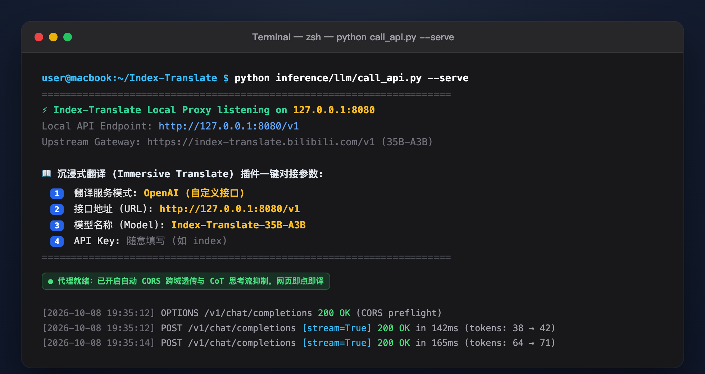
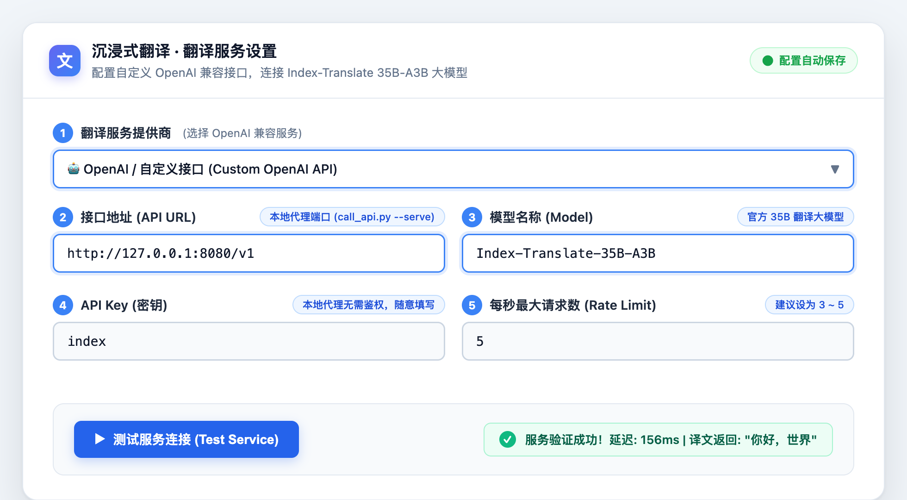
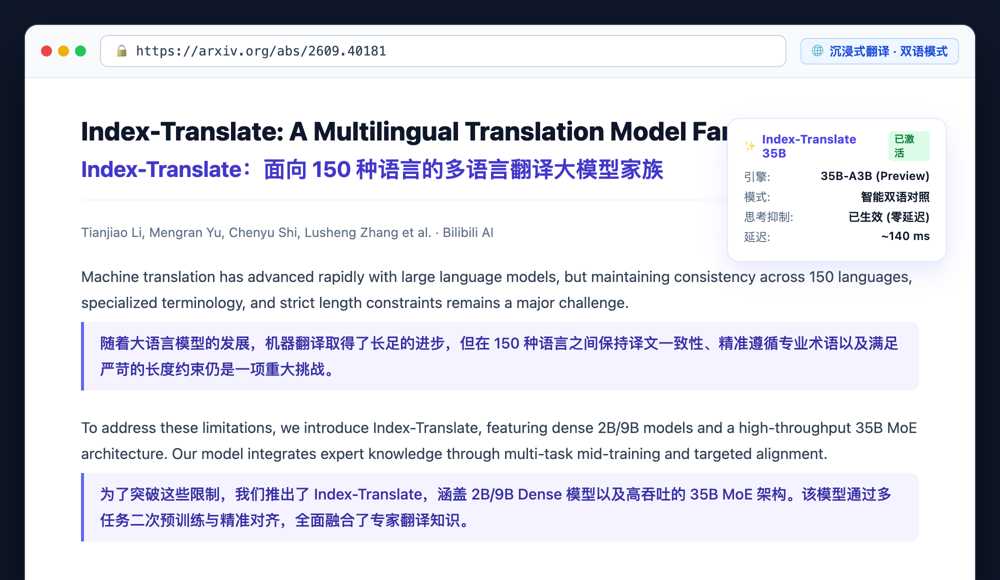

# Immersive Translate Configuration Guide

This guide explains how to connect the popular browser extension **[Immersive Translate](https://immersivetranslate.com/)** to the **Index-Translate** multilingual model family for ultra-fast, high-accuracy, and private bilingual web and document translation.

---

## 🌟 Key Highlights

- **Free Public 35B Flagship Model**: Access the official free online API (powered by Index-Translate-35B-A3B) without requiring a local GPU.
- **100% Private Offline Deployment**: Optionally connect to locally self-hosted vLLM or SGLang instances (2B / 9B models), keeping your data strictly within your local machine.
- **Thinking Suppression & Low Latency**: The official bridge proxy automatically suppresses Chain-of-Thought (`enable_thinking=False`) and enables greedy decoding (`temperature=0.0`), delivering first-token response in ~150ms without raw `<think>` tag pollution.
- **Native Bilingual Layout**: Seamlessly integrates into Immersive Translate's dual-language web paragraphs, hover lookup, PDF translation, and EPUB reading modes.

---

## 🛠️ Architecture: Why is a Local Bridge Proxy Recommended?

Browser extensions calling external LLM APIs often encounter technical constraints:
1. **Browser CORS and Header Security**: Browsers restrict cross-origin requests and custom header handling from extension sandboxes.
2. **Chain-of-Thought (CoT) Suppression**: Index-Translate-35B features advanced reasoning abilities. In bilingual web translation scenarios, thinking output must be explicitly disabled (`enable_thinking=False`) with zero temperature (`temperature=0.0`) to avoid parsing stalls and latency spikes.
3. **WAF Protection**: Prevents browser plugin direct calls from tripping upstream web protection challenges.

To solve this, the repository includes a zero-dependency local proxy in [`inference/llm/call_api.py`](../inference/llm/call_api.py):

```
[Browser / Immersive Translate Extension]
                 │ (HTTP 127.0.0.1:8080/v1)
                 ▼
[Local Bridge Proxy: call_api.py --serve]
   - Automatic CORS pass-through
   - Injects enable_thinking=False
   - Injects temperature=0.0
                 │ (HTTPS encrypted)
                 ▼
[Index-Translate Public API / Local vLLM]
```

---

## 📖 Step-by-Step Setup

### Step 1: Install Immersive Translate

Install the extension from your browser's official store:
- [Chrome Web Store](https://chromewebstore.google.com/detail/immersive-translate/bpoadfkcbjbfhfodiogcnhhhpibjhbnh)
- [Edge Add-ons](https://microsoftedge.microsoft.com/addons/detail/immersive-translate/amkbmndfnliijdhojkpoglbnaaahippg)
- [Firefox Add-ons](https://addons.mozilla.org/firefox/addon/immersive-translate/)
- [Safari (Mac / iOS)](https://apps.apple.com/app/immersive-translate/id6447957425)

---

### Step 2: Start the Backend Service (Choose One)

#### Option A: Free Online 35B API (Recommended, No Local GPU Needed)

Clone the repository and run the zero-dependency proxy:

```bash
git clone https://github.com/bilibili/Index-Translate.git
cd Index-Translate

# Start local bridge proxy (defaults to 127.0.0.1:8080)
python inference/llm/call_api.py --serve
```

Terminal output:



> [!TIP]
> **LAN Sharing**: To share this service with mobile phones, tablets, or other PCs on your local network, add `--host 0.0.0.0`:
> ```bash
> python inference/llm/call_api.py --serve --host 0.0.0.0
> ```

#### Option B: Self-Hosted Local GPU Deployment (vLLM)

For users with a local NVIDIA GPU (e.g. 9B model):

```bash
vllm serve IndexTeam/Index-Translate-9B \
    --served-model-name Index-Translate-9B \
    --host 127.0.0.1 \
    --port 8000 \
    --max-model-len 4096
```

---

### Step 3: Configure Immersive Translate

1. Open Immersive Translate **Options / Settings** by clicking its toolbar icon.
2. In the left navigation, click **Translation Services**, then scroll down to **Developer Settings**.
3. Enable **OpenAI** (or click "Add Custom Model").
4. Fill in the parameters as shown below:

| Field | Option A (Cloud 35B via Proxy) | Option B (Local vLLM) | Note |
|---|---|---|---|
| **Translation Service** | `OpenAI` | `OpenAI` | Standard OpenAI-compatible API |
| **API URL** | `http://127.0.0.1:8080/v1` | `http://127.0.0.1:8000/v1` | Must end with `/v1` |
| **Model** | `Index-Translate-35B-A3B` | `Index-Translate-9B` | Must match the served model name |
| **API Key** | `index` | `none` | Any placeholder string works |
| **Rate Limit (Max Req/s)** | `3` ~ `5` | Based on GPU power (e.g. `5` ~ `10`) | Prevents concurrency queuing |

Settings reference:



5. Click **Test Service**:
   - When you see a green checkmark `✓ Service Available` (or translation verification `"Hello World" -> "你好，世界"`), the configuration is complete!

---

### Step 4: Bilingual Browsing Experience

1. Navigate to any foreign-language article (e.g. [arXiv:2609.40181](https://arxiv.org/abs/2609.40181), GitHub, Hacker News, Wikipedia).
2. Press `Alt + A` (`Option + A` on Mac), or click the floating translation button.
3. Enjoy crisp bilingual translation powered by Index-Translate:



---

## ❓ Troubleshooting (FAQ)

### 1. Connection Timeout or 504 Gateway Timeout?
- **Verify the proxy is running**: Ensure the `python inference/llm/call_api.py --serve` process is active in your terminal.
- **Bypass local loopback in VPN/proxies**: Some VPN/proxy tools hijack `127.0.0.1`. Add `127.0.0.1` and `localhost` to your bypass list.
- **Port Conflict**: If port `8080` is in use, start with a custom port:
  ```bash
  python inference/llm/call_api.py --serve 8088
  ```
  Then set the API URL in the extension to `http://127.0.0.1:8088/v1`.

### 2. Seeing `<think>` tags in output?
- The official `call_api.py --serve` automatically injects `{"chat_template_kwargs": {"enable_thinking": False}, "temperature": 0.0}` to suppress thinking tokens.
- When connecting directly to custom endpoints without the proxy, make sure `enable_thinking=false` is configured in your client request parameters.

---

## 🔗 Related Resources

- [Index-Translate GitHub Repository](https://github.com/bilibili/Index-Translate)
- [Public Online API Script Guide](../inference/llm/README.md#free-public-online-api--immersive-translate-proxy)
- [Native Lightweight Browser Extension](../extension/README.md)
